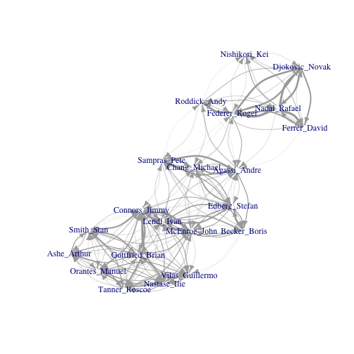

テニスの勝敗関係からネットワークを作る
===

[ここにある](https://github.com/gghatano/atp_scrape)男子テニスのデータで遊びます. 

## 内容確認

```r
library(dplyr)
library(data.table)
library(igraph)
options(rpubs.upload.method = "internal")

dat = fread("winLoseData.dat")
```

## 勝ち数ランキング

勝ち数で並べてみます. 主要な選手を取り出すためです. 

```r
dat_not_bye = dat %>% 
  filter(PLAYER_1 != "Bye") %>% 
  filter(PLAYER_2 != "Bye") 
  
dat_1 = dat_not_bye %>% 
  select(PLAYER_1, WINNER) %>% setnames(c("PLAYER", "WINNER"))
dat_2 = dat_not_bye %>% 
  select(PLAYER_2, WINNER) %>% setnames(c("PLAYER", "WINNER"))
dat_12 = 
  rbind(dat_1, dat_2)

dat_win = 
  dat_12 %>% 
  mutate(WIN_FLG = (PLAYER==WINNER)) %>% 
  group_by(PLAYER) %>% 
  summarise(WIN = sum(WIN_FLG), 
            GAME=length(WIN_FLG))

## 勝ち数ランキングと勝率
dat_win %>% 
  mutate(WIN_PROB = WIN / GAME) %>% 
  arrange(desc(WIN)) %>% 
  head(20) 
```

```
##             PLAYER  WIN GAME WIN_PROB
## 1    Connors_Jimmy 1184 1461   0.8104
## 2       Lendl_Ivan  997 1214   0.8213
## 3    Federer_Roger  920 1129   0.8149
## 4  Vilas_Guillermo  847 1108   0.7644
## 5     McEnroe_John  804  982   0.8187
## 6     Agassi_Andre  788 1034   0.7621
## 7    Edberg_Stefan  711  938   0.7580
## 8     Nastase_Ilie  708 1005   0.7045
## 9     Sampras_Pete  685  876   0.7820
## 10    Nadal_Rafael  679  809   0.8393
## 11 Gottfried_Brian  638  941   0.6780
## 12      Smith_Stan  626  888   0.7050
## 13    Becker_Boris  619  819   0.7558
## 14     Ashe_Arthur  612  824   0.7427
## 15   Chang_Michael  605  892   0.6783
## 16  Orantes_Manuel  603  834   0.7230
## 17    Roddick_Andy  572  759   0.7536
## 18   Tanner_Roscoe  568  836   0.6794
## 19    Ferrer_David  567  844   0.6718
## 20  Djokovic_Novak  556  680   0.8176
```

## 上位10人 + 錦織でネットワーク作成
勝敗関係からネットワークを作ります. 

まずは行列を作ります. 

```r
## 勝ち数ランキングと勝率
topplayers = 
  dat_win %>% 
  mutate(WIN_PROB = WIN / GAME) %>% 
  arrange(desc(WIN)) %>% 
  head(20) %>% 
  select(PLAYER) %>% unlist

# topplayers

## 錦織もおまけで入れてあげます
topplayers = c(topplayers, "Nishikori_Kei")

dat_win_lose = 
  dat %>% 
  filter(PLAYER_1 %in% topplayers & PLAYER_2 %in% topplayers) %>% 
  mutate(LOSER = ifelse(PLAYER_1 == WINNER, PLAYER_2, PLAYER_1)) %>% 
  select(WINNER, LOSER) %>% 
  group_by(WINNER,LOSER) %>% 
  filter(WINNER != "") %>% 
  summarise(TIME= n()) %>% 
  arrange(desc(TIME)) %>% 
  group_by(add=FALSE) %>% 
  filter(WINNER %in% topplayers) %>% 
  filter(LOSER %in% topplayers) 

mat = dat_win_lose %>% 
  xtabs(formula = TIME ~ .) 
```


接続行列から有向グラフを作ります. 

```r
graph  = graph.adjacency(mat, mode="directed", weighted = TRUE)
set.seed(1)
V(graph)$size <- 5
V(graph)$color <- NA
V(graph)$frame.color <- NA
E(graph)$width = E(graph)$weight / 5
E(graph)$arrow.size = 0.7
plot(graph, layout=layout.auto, edge.curved=0.4)
```

 

なるほど. 

## ページランクでランキング

PageRankでランキングをつけてみます. 

勝率や勝ち数のランキングと比べて, 変化がありますかね?


```r
## 勝ち数ランキングと勝率
topplayers = 
  dat_win %>% 
  mutate(WIN_PROB = WIN / GAME) %>% 
  arrange(desc(WIN)) %>% 
  head(100) %>% 
  select(PLAYER) %>% unlist

dat_win_lose = 
  dat %>% 
  filter(PLAYER_1 %in% topplayers & PLAYER_2 %in% topplayers) %>% 
  mutate(LOSER = ifelse(PLAYER_1 == WINNER, PLAYER_2, PLAYER_1)) %>% 
  select(WINNER, LOSER) %>% 
  group_by(WINNER,LOSER) %>% 
  filter(WINNER != "") %>% 
  summarise(TIME= n()) %>% 
  arrange(desc(TIME)) %>% 
  group_by(add=FALSE) %>% 
  filter(WINNER %in% topplayers) %>% 
  filter(LOSER %in% topplayers) 
  
mat = dat_win_lose %>% 
  xtabs(formula = TIME ~ .) 

graph  = graph.adjacency(mat, mode="directed", weighted = TRUE)
page.rank(graph)$vector %>% sort(decreasing = TRUE) %>% head(10)
```

```
##  Alexander_John Gottfried_Brian Santoro_Fabrice  Solomon_Harold 
##         0.01657         0.01516         0.01498         0.01472 
##     Lutz_Robert    Fibak_Wojtek    Nastase_Ilie       Dent_Phil 
##         0.01440         0.01436         0.01393         0.01391 
## Fillol_Sr_Jaime     Dibbs_Eddie 
##         0.01380         0.01328
```
よく分かんねえ

